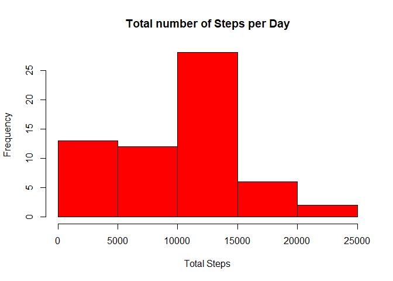
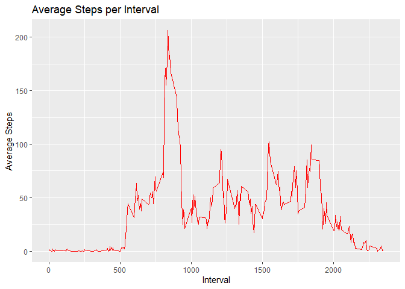
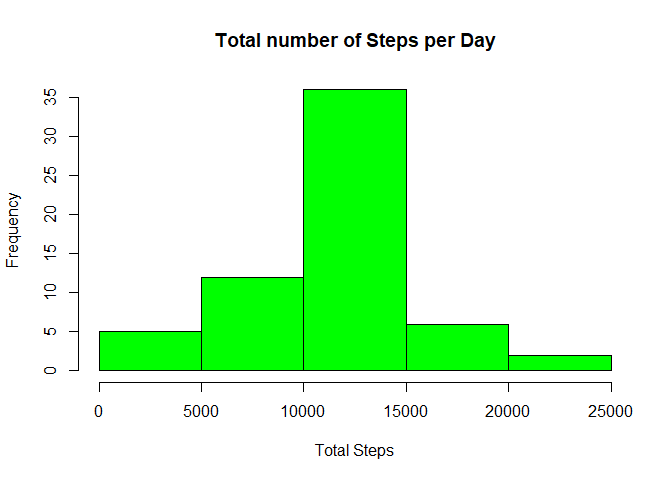

## Loading and preprocessing the data

```r
unzip(zipfile="repdata_data_activity.zip") ## unzip zip file and extract it out
dat <- read.csv("activity.csv")
summary(dat)
```

```
##      steps                date          interval     
##  Min.   :  0.00   2012-10-01:  288   Min.   :   0.0  
##  1st Qu.:  0.00   2012-10-02:  288   1st Qu.: 588.8  
##  Median :  0.00   2012-10-03:  288   Median :1177.5  
##  Mean   : 37.38   2012-10-04:  288   Mean   :1177.5  
##  3rd Qu.: 12.00   2012-10-05:  288   3rd Qu.:1766.2  
##  Max.   :806.00   2012-10-06:  288   Max.   :2355.0  
##  NA's   :2304     (Other)   :15840
```

```r
head(dat) ## preview data
```

```
##   steps       date interval
## 1    NA 2012-10-01        0
## 2    NA 2012-10-01        5
## 3    NA 2012-10-01       10
## 4    NA 2012-10-01       15
## 5    NA 2012-10-01       20
## 6    NA 2012-10-01       25
```

```r
str(dat) ## understand variables and its data type
```

```
## 'data.frame':	17568 obs. of  3 variables:
##  $ steps   : int  NA NA NA NA NA NA NA NA NA NA ...
##  $ date    : Factor w/ 61 levels "2012-10-01","2012-10-02",..: 1 1 1 1 1 1 1 1 1 1 ...
##  $ interval: int  0 5 10 15 20 25 30 35 40 45 ...
```

```r
dat$date <- as.Date(dat$date, format="%Y-%m-%d")
```


## What is mean total number of steps taken per day?

```r
q1 <- with(dat,tapply(steps,date,sum,na.rm=TRUE)) ## total number of steps group by date
hist(q1,
	main="Total number of Steps per Day",
	xlab="Total Steps",ylab="Frequency",
	col="red")
```

<!-- -->

```r
mean(q1)
```

```
## [1] 9354.23
```

```r
median(q1)
```

```
## [1] 10395
```


## What is the average daily activity pattern?

```r
aveSteps <- with(dat, tapply(steps,interval,mean,na.rm=TRUE)) ## average steps
interval <- unique(dat$interval) 
dat2 <- data.frame(cbind(interval,aveSteps))
library(ggplot2)
ggplot(data = dat2,aes(x = interval,y = aveSteps))+
	geom_line(color="red")+
	ggtitle("Average Steps per Interval") + xlab("Interval") + ylab("Average Steps")
```

<!-- -->

```r
dat2[which.max(dat2$aveSteps),1]
```

```
## [1] 835
```


## Imputing missing values

```r
sum(is.na(dat$steps))
```

```
## [1] 2304
```

```r
index <- which(is.na(dat$steps)) ## find location of missing value
len <- length(which(is.na(dat$steps)))
aveSteps2 <- with(dat, tapply(steps,date,mean,na.rm=TRUE))
valuetoreplace <- mean(with(dat,tapply(steps,date,mean,na.rm=TRUE)),na.rm = TRUE)
for (i in 1:len) {
        dat[index[i],1] <- valuetoreplace ## replace missing value with mean of steps
}
new <- with(dat,tapply(steps,date,sum,na.rm=TRUE))
hist(new,
	main="Total number of Steps per Day",
	xlab="Total Steps",ylab="Frequency",
	col="green")
```

<!-- -->

```r
mean(new)
```

```
## [1] 10766.19
```

```r
median(new)
```

```
## [1] 10766.19
```


## Are there differences in activity patterns between weekdays and weekends?

```r
library(dplyr)
```

```
## 
## Attaching package: 'dplyr'
```

```
## The following objects are masked from 'package:stats':
## 
##     filter, lag
```

```
## The following objects are masked from 'package:base':
## 
##     intersect, setdiff, setequal, union
```

```r
newdat <- mutate(dat, day=ifelse(weekdays(dat$date)=="Saturday" | weekdays(dat$date)=="Sunday","weekend","weekday"))
newdat$day<-as.factor(newdat$day)
library(lattice)
stepsByDay <- with(newdat,aggregate(steps ~ interval + day, newdat, mean))
xyplot(steps ~ interval | day, stepsByDay , type = "l", layout = c(1, 2), 
    xlab = "Interval", ylab = "Number of steps")
```

<!-- -->
